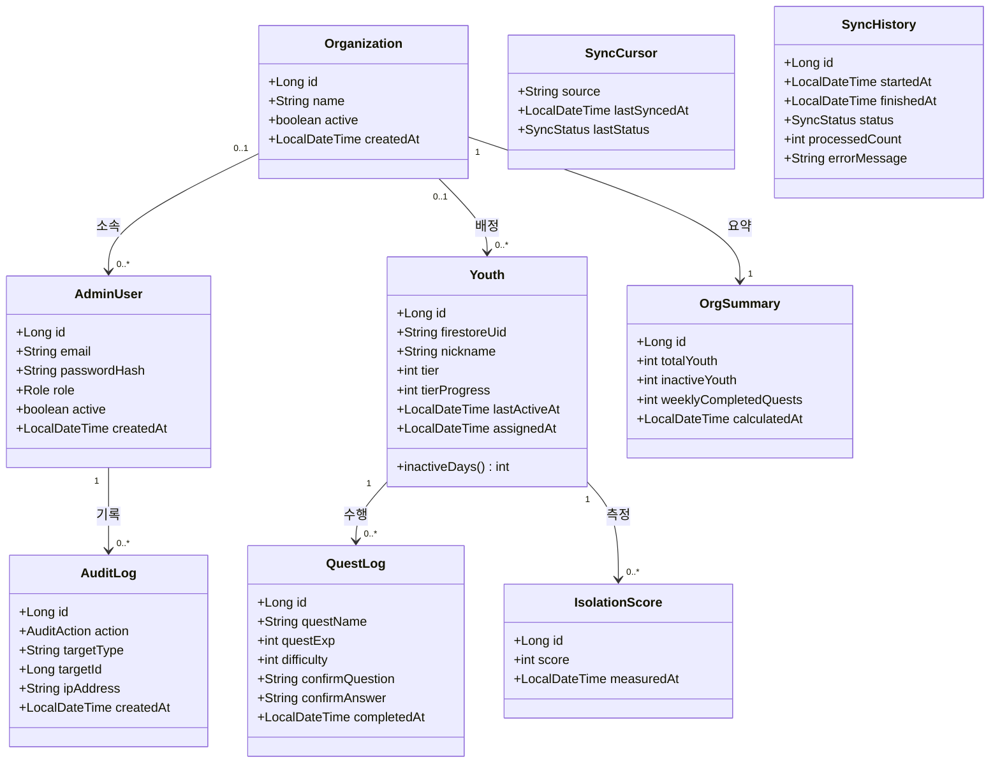
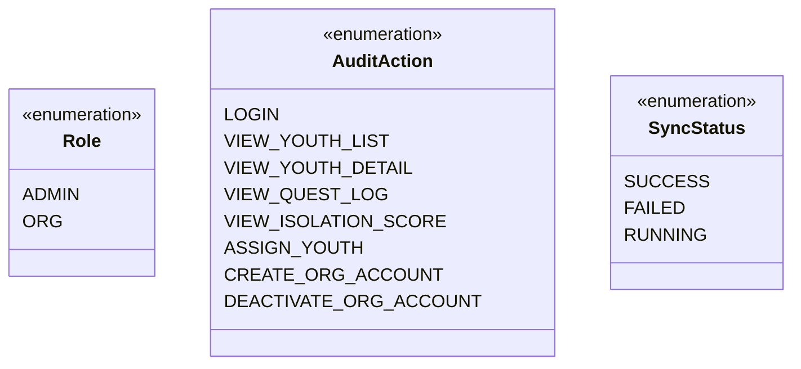
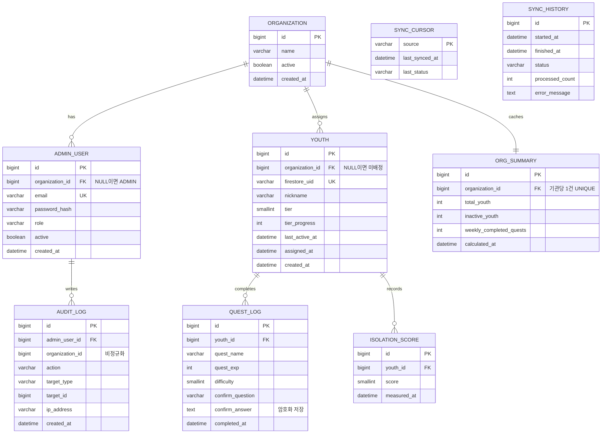

# 도메인 모델

## 1. 개념 클래스 다이어그램

### 열거형

---

## 2. 다중도 설명

| 관계 | 다중도 | 근거 |
|---|---|---|
| Organization ↔ AdminUser | 0..1 : 0..* | ADMIN 계정은 기관에 속하지 않음 (organization_id = NULL) |
| Organization ↔ Youth | 0..1 : 0..* | 동기화 직후 청년은 미배정 상태. 한 청년은 한 기관에만 배정 |
| Organization ↔ OrgSummary | 1 : 1 | UC-12의 캐시 테이블 |
| Youth ↔ QuestLog | 1 : 0..* | |
| Youth ↔ IsolationScore | 1 : 0..* | 시계열 |
| AdminUser ↔ AuditLog | 1 : 0..* | 계정 비활성화 후에도 기록은 유지 |

---

## 3. ERD

---

## 4. 제약 조건

| 테이블 | 제약 | 목적 |
|---|---|---|
| `youth` | `UNIQUE (firestore_uid)` | 동기화 시 upsert 기준 |
| `quest_log` | `UNIQUE (youth_id, completed_at)` | **동기화 멱등성** (UC-14 4b) |
| `admin_user` | `UNIQUE (email)` | 로그인 식별자 |
| `org_summary` | `UNIQUE (organization_id)` | 기관당 1건 |

---

## 5. 인덱스

| 테이블 | 인덱스 | 대응 유스케이스 |
|---|---|---|
| `youth` | `(organization_id, last_active_at)` | UC-07 목록 조회·정렬 |
| `quest_log` | `(youth_id, completed_at DESC)` | UC-09 이력 조회 |
| `isolation_score` | `(youth_id, measured_at)` | UC-10 추이 조회 |
| `audit_log` | `(organization_id, created_at)` | 열람 기록 추적 |
| `audit_log` | `(admin_user_id, created_at)` | 계정별 이상 탐지 |

---

## 6. 설계 노트

### 미배정 청년을 NULL로 둔 이유

동기화는 Firestore의 모든 사용자를 가져오지만, 그중 기관이 관리하는 청년은 일부다. `organization_id`를 NULL로 두면 어느 기관의 조회에도 걸리지 않으므로, **기본값이 비노출**이 된다.

ADMIN이 UC-11로 명시적으로 배정해야만 특정 기관에 보인다. 실수로 전체가 노출되는 사고를 구조적으로 막는다.

### quest_log에 UNIQUE를 건 이유

UC-14에서 동기화 실패 시 커서를 갱신하지 않고 재시도한다. 이미 저장된 구간을 다시 읽게 되므로 중복이 발생하는데, `(youth_id, completed_at)` 제약이 이를 DB 레벨에서 막는다.

애플리케이션에서 조회 후 판단하는 방식은 동시 실행 시 경합이 생길 수 있어 제약으로 처리한다.

### confirm_answer를 암호화하는 이유

청년이 퀘스트 수행 후 직접 작성한 답변으로, 정신건강·일상 상태가 드러나는 민감정보다. DB가 유출되더라도 내용이 노출되지 않도록 컬럼 단위로 암호화한다.

**트레이드오프**: 암호화된 컬럼은 인덱스를 탈 수 없어 검색·정렬이 불가능하다. 현재 범위에서는 검색 요구가 없으므로 수용한다. 향후 필요해지면 블라인드 인덱스를 별도 컬럼으로 둔다.

### OrgSummary를 별도 테이블로 둔 이유

UC-12의 특수 사항은 "업데이트 불필요 시 조회 속도 최우선"이다. 매 요청마다 청년 수, 미접속자 수, 주간 퀘스트 수를 집계하면 청년 수에 비례해 느려진다.

계산 결과를 캐시하고, `calculated_at` 이후 새 활동이 있을 때만 재계산한다.

### AuditLog에 organization_id를 중복 저장한 이유

`admin_user_id`로 조인하면 기관을 알 수 있지만, 감사 로그는 조회 빈도가 높고 건수가 가장 빠르게 증가한다. 조인 없이 기관별 필터링이 가능하도록 비정규화했다.

또한 계정이 삭제되거나 소속이 바뀌어도 **당시 어느 기관 소속으로 열람했는지**가 보존된다.

### QuestLog에 place·mood·questLevel을 두지 않은 이유

앱의 Firestore 완료 기록(`PrevQuest`)에는 `questName, questEXP, difficulty, confirmQuestion, confirmAnswer, doneDate` 6개 필드만 저장된다. 장소(`Place`)는 퀘스트 제시 시 템플릿 치환에만 쓰이고, 기분(`Mood`)은 난이도 산정 입력값으로만 쓰여 완료 기록에 남지 않는다. 동기화할 원본이 없는 컬럼은 두지 않는다.

필요해지면 앱이 완료 기록에 해당 필드를 먼저 추가해야 하고, 그 전까지 이 세 값은 모델링하지 않는다.

### tier_progress 매핑 근거

Firestore `users.progress`는 누적 경험치가 아니라 **현재 티어 내 진행도**다(`calculateTierProgress`가 티어 상승 시 임계값만큼 차감한다). 이름을 `totalExp`로 두면 "총 누적 경험치"로 오해하므로 소스 의미에 맞춰 `tier_progress`로 명명한다.

### Youth에 앱 원본 데이터를 복제하는 이유

Firestore가 원본이지만, 관리자 웹은 조인·정렬·집계가 필요하다. Firestore는 이런 조회에 적합하지 않고 읽기 비용도 발생한다.

단방향 복제이며 **MySQL에서 Firestore로 쓰지 않는다** (UC-14 특수 사항).